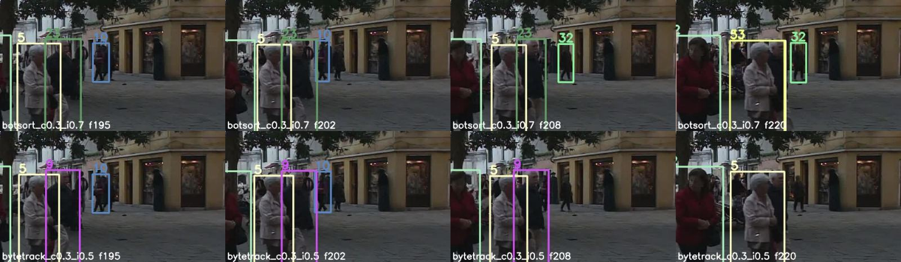
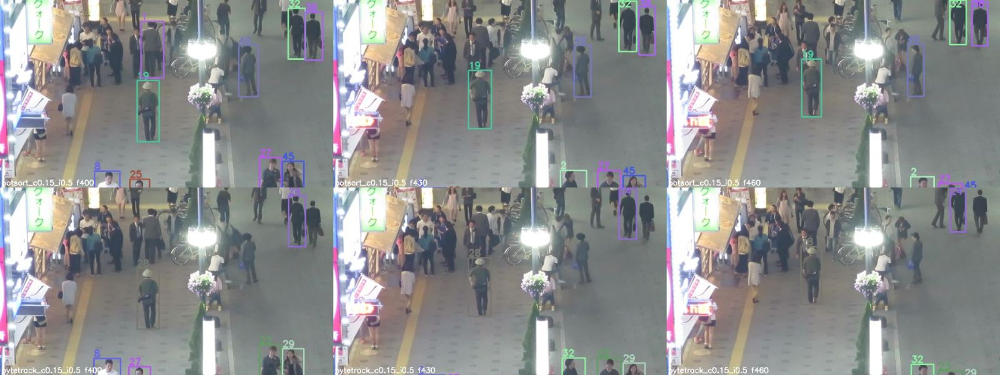
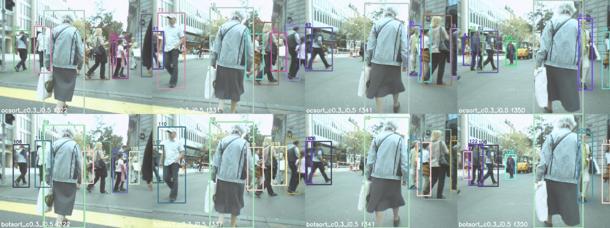
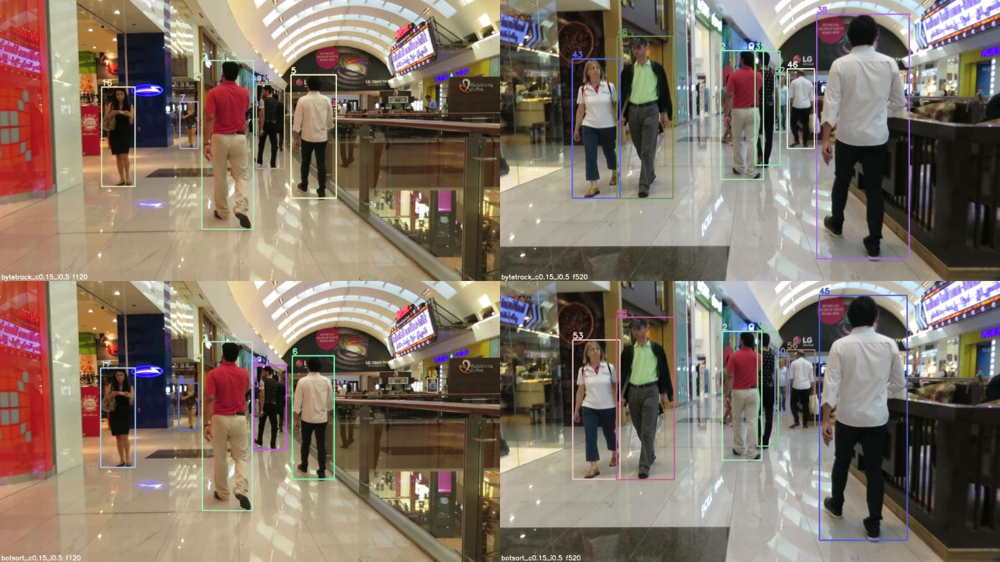
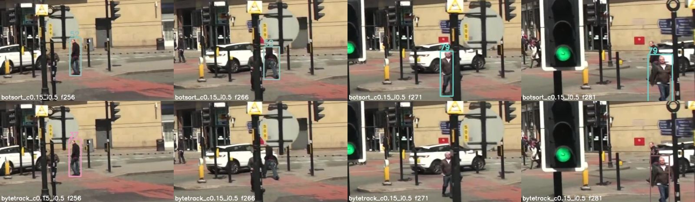

# Báo cáo lab: chọn tracker cho 5 video

**Nhóm:** Kiên – Vinh **Thành viên:** Nguyễn Trần Kiên – 2A202602571 · Tạ Hoàng Vinh – 2A202602543

Detector cố định: `yolo26n.pt`, ảnh 640 px, Re-ID `osnet_x0_25_msmt17`. Không đổi các mục này trong bài nộp chính.

Môi trường chạy: CPU (`--device cpu`), Python 3.11, `boxmot==10.0.42`, `ultralytics` 8.4. Năm file nộp nằm trong `runs/nop_bai/`, tạo bằng `scripts/run_tracking.py` **không** có `--max-frames`.

## 0. Giả thuyết trước khi chạy (CP1) và baseline (CP2)

Notebook `on_tap_metrics.ipynb` đã chạy: 3 câu True/False đều đúng (True / False / True). YOLO trên frame đầu của `video_1` cho 6 hộp ở `conf=0.3`, 14 hộp ở `conf=0.15`, 5 hộp ở `conf=0.5` — hộp có, ID chưa có.

Giả thuyết nhóm ghi lại trước khi thử:

| Cảnh | Dự đoán | Kết quả sau khi thử |
|---|---|---|
| `video_2` (đêm, rất đông) | Người cắt ngang nhau nhiều nên tracker có Re-ID sẽ giữ ID tốt hơn ByteTrack. | Đúng một phần: BoT-SORT giữ được nhiều người hơn, nhưng thứ giới hạn chính là detector bỏ sót đám đông ở xa, không phải việc ghép ID. |
| `video_3` (camera di chuyển, ít frame/giây) | Chuyển động khó đoán nên tracker Re-ID (BoT-SORT) sẽ thắng tracker chuyển động. | **Sai**: BoT-SORT đứt track nhiều hơn OC-SORT ở cảnh này (xem mục 3). |
| `video_5` (trên xe bus, rung lắc) | Cần bù chuyển động camera và Re-ID để nối lại người sau khi bị cột đèn che. | Đúng: BoT-SORT nối lại nhanh hơn, ByteTrack mất hộp lâu hơn. |

Baseline (CP2): `video_1` + ByteTrack, `conf=0.3`, `iou=0.5`, 150 frame (`runs/thu_nhanh/`). Nhóm người đi bộ ở tiền cảnh (bà áo tím, người áo đỏ, bà áo trắng) giữ nguyên ID và màu suốt 150 frame. Lỗi nhìn thấy: những người nhỏ ở xa dưới tán cây và bên phải quảng trường không có hộp nào — baseline bỏ sót chứ không gán nhầm.

## 1. Cấu hình đã chọn

Mỗi video: tracker bạn nộp, `conf`, `iou`, điều bạn **nhìn thấy** trên video, và một cấu hình đã thử rồi loại.

| Video | Tracker | conf | iou | Quan sát khi xem video | Đã thử nhưng loại |
|---|---|---|---|---|---|
| video_1 (quảng trường, tĩnh, ban ngày) | `botsort` | 0.3 | 0.7 | Nhóm người ở tiền cảnh giữ ID ổn định. Người nhỏ ở xa có thêm hộp so với ByteTrack. Còn đổi ID khi một người ở xa đi khuất sau người khác (ID 10 → 32 quanh frame 202–208). | `bytetrack` 0.3/0.5: ít đổi ID nhất nhưng bỏ sót nhiều người ở xa nên HOTA thấp hơn (26.9 so với 30.0). `ocsort` và `strongsort` ở `conf=0.15`: hộp giả tăng gấp ~6 lần, ID nhảy liên tục. |
| video_2 (phố đêm, tĩnh, rất đông) | `botsort` | 0.15 | 0.5 | Người đi riêng lẻ giữa phố (ông đội mũ, các cặp đi bộ) giữ một ID suốt hàng trăm frame. Đám đông đứng trước cửa hàng bên trái gần như không có hộp nào: detector bỏ sót vì người nhỏ, tối và che nhau. | `bytetrack` 0.15/0.5: giữ ID tốt nhưng ít hộp hơn hẳn (trong một cặp đi cạnh nhau chỉ một người có ID). `ocsort` 0.15/0.5: nhiều track vụn chỉ dài vài frame. `botsort` 0.5/0.5: mất thêm người ở xa. |
| video_3 (camera di động, ảnh nhỏ) | `ocsort` | 0.3 | 0.5 | Người ở gần camera giữ ID suốt đoạn dài (bà áo xám giữ ID 18 qua các frame 322–350). Người ở xa bị đổi ID khi bị người gần che rồi hiện lại (ví dụ ID 58 → 90 quanh frame 331–341). | `botsort` 0.3/0.5: cùng số hộp nhưng nhiều track ngắn và nhiều lần sinh ID mới ngay cạnh track vừa mất hơn. `ocsort` 0.15/0.5: hộp giả và ID vụn tăng mạnh. `ocsort` 0.3/0.7: track ngắn tăng (65 so với 47). |
| video_4 (trong nhà, camera di chuyển) | `botsort` | 0.15 | 0.5 | Người ở gần (áo đỏ, áo trắng) có hộp khít, ID giữ lâu; người áo đỏ giữ ID 2 hơn 700 frame. Người ở cuối hành lang có thêm hộp. Không thấy hộp giả trên phản chiếu ở lan can kính tại các frame đã xem. Người áo trắng đổi ID một lần (6 → 45) quanh frame 322–337. | `bytetrack` 0.15/0.5: ID người ở gần cũng ổn, nhưng bỏ người ở xa và người áo trắng cũng bị đổi ID (5 → 38). `ocsort` 0.15/0.5: rất nhiều track dưới 10 frame. `botsort` 0.3/0.5: nhiều track ngắn hơn bản 0.15. |
| video_5 (trên xe bus, giao lộ đông) | `botsort` | 0.15 | 0.5 | Người đi bộ nhỏ, ở xa, hay bị cột đèn và biển báo che. BoT-SORT nối lại người sau khi qua cột chỉ trong vài frame, nhưng với ID mới (52 → 79 quanh frame 266–271). | `bytetrack` 0.3/0.5 và 0.15/0.5: sau khi người đi khuất cột đèn thì mất hộp lâu hơn (không có hộp ở frame 266–271) và ít người có hộp hơn. `strongsort` 0.3/0.5: nhiều track vụn nhất. `botsort` 0.5/0.5: số hộp giảm gần một nửa (2.4 so với 4.4 hộp/frame). |

Ghi chú về cách thử: mỗi video chạy cả 5 tracker ở `conf=0.3`, `iou=0.5`; sau đó với tracker chuyển động (`bytetrack`, `ocsort`) và tracker Re-ID có vẻ hơn (`botsort`) thử `conf` 0.15 / 0.5 và `iou` 0.4 / 0.7, mỗi lần đổi một tham số. Riêng `video_1` (có nhãn) thử đủ lưới cho cả 5 tracker.

## 2. Số liệu video_1

Dán bảng HOTA / MOTA / IDF1 do `scripts/evaluate_practice.py` in ra.

```
HOTA: nhom_kien_vinh_video1-pedestrianHOTA      DetA      AssA      DetRe     DetPr     AssRe     AssPr     LocA      OWTA      HOTA(0)   LocA(0)   HOTALocA(0)
video_1                            29.969    18.408    49.061    19.176    74.385    52.38     80.959    83.019    30.624    37.181    76.409    28.409
COMBINED                           29.969    18.408    49.061    19.176    74.385    52.38     80.959    83.019    30.624    37.181    76.409    28.409

CLEAR: nhom_kien_vinh_video1-pedestrianMOTA      MOTP      MODA      CLR_Re    CLR_Pr    MTR       PTR       MLR       sMOTA     CLR_TP    CLR_FN    CLR_FP    IDSW      MT        PT        ML        Frag
video_1                            19.025    80.817    19.202    22.491    87.244    14.516    17.742    67.742    14.71     4179      14402     611       33        9         11        42        105
COMBINED                           19.025    80.817    19.202    22.491    87.244    14.516    17.742    67.742    14.71     4179      14402     611       33        9         11        42        105

Identity: nhom_kien_vinh_video1-pedestrianIDF1      IDR       IDP       IDTP      IDFN      IDFP
video_1                            29.703    18.68     72.463    3471      15110     1319
COMBINED                           29.703    18.68     72.463    3471      15110     1319

Count: nhom_kien_vinh_video1-pedestrianDets      GT_Dets   IDs       GT_IDs
video_1                            4790      18581     55        62
COMBINED                           4790      18581     55        62
```

Tóm tắt cấu hình nộp (`botsort`, conf 0.3, iou 0.7): **HOTA 29.97 · MOTA 19.03 · IDF1 29.70**.

Các cấu hình đã thử trên `video_1` (chấm cùng nhãn, cùng thang TrackEval):

| Tracker | conf | iou | HOTA | DetA | AssA | MOTA | IDF1 | Đổi ID | Hộp giả | Bỏ sót |
|---|---|---|---|---|---|---|---|---|---|---|
| **botsort** | **0.3** | **0.7** | **29.97** | 18.41 | 49.06 | 19.02 | 29.70 | 33 | 611 | 14402 |
| botsort | 0.15 | 0.7 | 29.66 | 19.43 | 45.63 | 20.33 | 29.88 | 39 | 700 | 14065 |
| botsort | 0.3 | 0.5 | 29.46 | 18.09 | 48.22 | 19.81 | 29.35 | 25 | 337 | 14538 |
| botsort | 0.15 | 0.5 | 29.34 | 19.24 | 45.11 | 20.73 | 29.56 | 27 | 505 | 14197 |
| botsort | 0.3 | 0.4 | 29.32 | 17.36 | 49.63 | 19.47 | 29.82 | 19 | 195 | 14750 |
| botsort | 0.5 | 0.5 | 27.17 | 14.30 | 51.65 | 15.25 | 24.56 | 10 | 229 | 15508 |
| strongsort | 0.15 | 0.5 | 29.19 | 21.61 | 40.04 | 19.91 | 32.57 | 110 | 1432 | 13340 |
| strongsort | 0.3 | 0.5 | 28.66 | 17.71 | 46.60 | 19.70 | 29.85 | 41 | 231 | 14649 |
| strongsort | 0.5 | 0.5 | 25.09 | 14.17 | 44.50 | 15.97 | 22.62 | 19 | 68 | 15527 |
| ocsort | 0.3 | 0.4 | 28.62 | 17.87 | 46.02 | 19.86 | 29.84 | 35 | 246 | 14610 |
| ocsort | 0.3 | 0.5 | 27.46 | 17.88 | 42.35 | 19.81 | 28.73 | 42 | 253 | 14605 |
| ocsort | 0.3 | 0.7 | 26.62 | 17.91 | 39.79 | 19.46 | 27.53 | 91 | 297 | 14578 |
| ocsort | 0.15 | 0.5 | 25.93 | 21.57 | 31.74 | 19.50 | 29.18 | 165 | 1476 | 13317 |
| deepocsort | 0.3 | 0.5 | 27.38 | 17.84 | 42.21 | 19.76 | 27.80 | 51 | 248 | 14610 |
| deepocsort | 0.15 | 0.5 | 25.25 | 21.52 | 30.20 | 19.37 | 28.15 | 195 | 1471 | 13316 |
| bytetrack | 0.15 | 0.5 | 27.31 | 15.86 | 47.14 | 18.31 | 26.99 | 13 | 118 | 15047 |
| bytetrack | 0.3 | 0.5 | 26.91 | 15.07 | 48.13 | 17.29 | 25.71 | 12 | 107 | 15249 |
| bytetrack | 0.3 | 0.7 | 26.02 | 15.05 | 45.01 | 17.22 | 24.85 | 13 | 111 | 15257 |
| bytetrack | 0.5 | 0.5 | 25.26 | 13.95 | 45.79 | 15.87 | 23.44 | 14 | 87 | 15532 |

Đọc bảng:

- Số tuyệt đối thấp vì detector nano ở 640 px chỉ bắt được khoảng 22% số hộp nhãn (bỏ sót ~14 400 / 18 581). Mọi tracker đều bị chặn bởi DetA ≈ 14–21.
- BoT-SORT đứng đầu ở mọi mức `conf`. Chênh lệch giữa các biến thể BoT-SORT (trừ `conf=0.5`) chỉ 0.3–0.9 điểm HOTA, nên nhóm coi `0.3/0.7` và `0.15/0.5` là gần tương đương; nhóm nộp bản HOTA cao nhất.
- Ba thước đo không xếp hạng giống nhau, đúng như notebook: `strongsort` 0.15 có IDF1 cao nhất (32.57) nhưng 110 lần đổi ID; `botsort` 0.15/0.5 có MOTA cao nhất (20.73); `bytetrack` ít đổi ID nhất (12–13) nhưng HOTA thấp vì bỏ sót nhiều.
- Hạ `conf` xuống 0.15 làm DetA tăng với mọi tracker, nhưng với `ocsort` / `deepocsort` / `strongsort` thì AssA rơi 6–12 điểm và số lần đổi ID tăng 3–4 lần. BoT-SORT và ByteTrack chịu `conf` thấp tốt hơn vì hộp điểm thấp chỉ được dùng ở vòng ghép thứ hai.

`video_2` đến `video_5` không có nhãn trong gói lab. Không điền số cho các video đó.

## 3. Phân tích

Với **ít nhất hai video** (nên gồm một video bạn chỉ đánh giá bằng mắt), viết 3–5 câu:

- Tracker đã chọn giữ ID tốt hơn, hay ít hộp giả hơn, ở điểm nào bạn nhìn thấy?
- Cảnh đó (đứng yên / chuyển động, đông / thưa, sáng / tối, trong nhà / ngoài trời) khiến tracker này hợp hơn tracker kia như thế nào?

Ngoài việc xem video có vẽ ID, với bốn video không nhãn nhóm đếm thêm vài con số **không cần nhãn** trên chính file kết quả để đối chiếu với điều nhìn thấy: số hộp mỗi frame, số track ngắn dưới 10 frame, và số lần "một track kết thúc giữa khung hình rồi một ID mới xuất hiện ngay cạnh đó trong vòng 30 frame" (gọi tắt là *nghi đứt track*). Đây là số đếm, không phải HOTA / MOTA / IDF1, và không thay cho nhãn.

### video_1 — quảng trường, camera tĩnh, ban ngày (có nhãn)

Camera đứng yên và người đi chậm nên dự đoán chuyển động đã đủ để giữ ID người ở tiền cảnh: cả ByteTrack lẫn BoT-SORT đều giữ nguyên ID nhóm ba người đi ngang suốt đoạn. Khác biệt nằm ở người nhỏ phía xa: ByteTrack chỉ xuất 5.9 hộp/frame, BoT-SORT xuất 8.3 hộp/frame, và phần hộp thêm này phần lớn là đúng (DetA 18.4 so với 15.1) trong khi AssA gần như bằng nhau (49.1 so với 48.1). Cái giá là BoT-SORT đổi ID nhiều hơn (33 so với 12 lần), vì nó cố bám cả những người hay bị che. `iou=0.7` giữ lại thêm hộp chồng nhau khi hai người đứng sát, giúp DetA tăng nhẹ nhưng hộp giả tăng gần gấp đôi (611 so với 337) — đây là đánh đổi nhóm chấp nhận vì HOTA và AssA vẫn tăng.



### video_2 — phố đêm, camera tĩnh trên cao, rất đông (đánh giá bằng mắt)

Cảnh tối và người rất nhỏ nên ở `conf=0.3` nhiều người rõ ràng trong ảnh vẫn không có ID; hạ xuống 0.15 là thay đổi có tác dụng lớn nhất nhìn thấy được (BoT-SORT từ 11.7 lên 13.2 hộp/frame). Ở mức `conf` thấp này, BoT-SORT vẫn giữ ID ổn: ông đội mũ đi dọc phố giữ một ID qua các frame 400–460, hai cặp người đi cạnh nhau mỗi người một ID không tráo, track ngắn dưới 10 frame chỉ còn 4 (bản 0.3 là 12). OC-SORT ở cùng `conf=0.15` thì ngược lại: 127 ID, 42 track ngắn — hộp điểm thấp sinh track vụn. ByteTrack 0.15 sạch (3 lần nghi đứt track) nhưng chỉ 10.1 hộp/frame; trong cặp người đi ở góc trên phải nó chỉ gán ID cho một người. Camera tĩnh nên phần Re-ID không phải gánh chuyển động camera, chỉ dùng để nối lại người sau khi đi khuất cột đèn. Giới hạn còn lại là của detector: đám đông đứng trước cửa hàng bên trái hầu như không có hộp ở bất kỳ cấu hình nào.



### video_3 — camera di chuyển, ảnh nhỏ, ít frame/giây (đánh giá bằng mắt)

Đây là video duy nhất nhóm chọn tracker chuyển động, trái với giả thuyết ban đầu. Ở cùng `conf=0.3`, `iou=0.5`, OC-SORT và BoT-SORT xuất số hộp gần như nhau (5.8 và 5.7 hộp/frame) nhưng BoT-SORT có 68 track dưới 10 frame và 50 lần nghi đứt track, còn OC-SORT là 47 và 36. Trên video, cả hai đều giữ ID người ở gần camera; khác biệt nằm ở người cỡ vừa phía sau, nơi BoT-SORT sinh ID mới thường xuyên hơn. Nhóm cho rằng nguyên nhân là ảnh 640×480, người quay lưng và bị che nửa thân nên đặc trưng Re-ID kém tin cậy, còn tốc độ khung hình thấp làm bước bù chuyển động camera của BoT-SORT lệch; OC-SORT chỉ dựa vào quan sát gần nhất nên ít bị kéo sai hơn. Đây là suy đoán từ kết quả, nhóm chưa kiểm chứng riêng từng thành phần. `conf=0.15` bị loại vì track vụn tăng (108 track ngắn); `iou=0.7` bị loại vì track ngắn tăng từ 47 lên 65.



### video_4 — trong nhà, camera tiến tới, kính phản chiếu (đánh giá bằng mắt)

Ánh sáng tốt và người to nên detector làm việc dễ nhất trong năm video; cả ByteTrack và BoT-SORT đều giữ ID người ở gần. Nhóm chọn BoT-SORT `conf=0.15` vì hai lý do nhìn thấy được: người ở cuối hành lang có thêm hộp (7.4 so với 6.5 hộp/frame), và so với BoT-SORT `conf=0.3` thì track ngắn giảm từ 20 xuống 11 trong khi không thấy hộp giả trên phần phản chiếu ở lan can kính tại các frame đã kiểm tra. Điểm yếu thật: BoT-SORT có nhiều lần nghi đứt track hơn ByteTrack (14 so với 6), tức đánh đổi độ phủ lấy một ít ổn định ID. Lựa chọn này dựa trên bằng chứng có nhãn ở `video_1` (độ phủ thêm của BoT-SORT đáng giá hơn số lần đổi ID tăng), nhóm không chắc nó đúng cho cảnh trong nhà.



### video_5 — trên xe bus, giao lộ đông, rung lắc (đánh giá bằng mắt)

Camera vừa tiến vừa rẽ nên vị trí người trong ảnh thay đổi cả khi họ đứng yên; người đi bộ lại nhỏ và liên tục bị cột đèn, biển báo che. ByteTrack chỉ xuất 2.7–2.9 hộp/frame và mất hộp lâu sau mỗi lần che. BoT-SORT `conf=0.15` xuất 4.4 hộp/frame, có nhiều track dài hơn (21 track từ 60 frame trở lên so với 12) và ít lần nghi đứt track hơn bản `conf=0.3` (7 so với 11). StrongSORT cũng có Re-ID nhưng cho 104 ID và 23 lần nghi đứt track, kém nhất trong nhóm Re-ID. Lỗi còn lại của cấu hình đã chọn là đổi ID sau che khuất chứ không phải mất người: người đàn ông qua cột đèn ở frame 266–271 được bắt lại ngay nhưng với ID mới.



### Tổng hợp lỗi tracking đã tìm thấy (CP4)

| Kiểu lỗi (theo notebook) | Ví dụ cụ thể trong bài nộp | Nguyên nhân nhìn thấy |
|---|---|---|
| Bỏ sót người (kiểu C) | `video_2`: đám đông trước cửa hàng bên trái không có hộp. `video_1`: 42/62 người trong nhãn hầu như không được bám (ML 67.7%). | Detector nano ở 640 px không thấy người nhỏ, tối, che nhau. Tracker không sửa được. |
| Đổi ID một lần rồi giữ sai (kiểu A) | `video_1`: ID 10 → 32 (frame 202–208). `video_4`: ID 6 → 45 (frame 322–337), ID 2 → 79 (frame 709–720). `video_5`: ID 52 → 79 (frame 266–271). | Người bị che từ vài đến vài chục frame; khi hiện lại tracker mở track mới thay vì nối track cũ. |
| Đổi ID liên tục / track vụn (kiểu B) | Không còn rõ trong bài nộp; thấy rõ ở các cấu hình đã loại (`ocsort` / `strongsort` / `deepocsort` với `conf=0.15`: 110–195 lần đổi ID trên `video_1`). | Hộp điểm thấp chập chờn sinh và hủy track liên tục. |
| Hộp trùng | `video_1` với `iou=0.7`: hộp giả 611 so với 337 ở `iou=0.5`. | NMS lỏng giữ hai hộp trên cùng một người khi họ đứng sát nhau. |

## 4. Nếu có thêm thời gian

- Quét `conf` mịn hơn (0.05–0.25, bước 0.05) riêng cho `video_2` và `video_5`, vì ở hai cảnh này bỏ sót là lỗi chính và BoT-SORT vẫn ổn khi hạ `conf`.
- Kiểm chứng suy đoán ở `video_3`: xem từng frame quanh các lần đứt track của BoT-SORT để tách lỗi do Re-ID và lỗi do bù chuyển động camera, và thử `strongsort` / `deepocsort` với cùng lưới `conf`, `iou`.

## Phụ lục: thay đổi nhỏ trong repo

- `scripts/evaluate_practice.py`: gói `data_lab21.zip` không có `video_1/eval_config.json` nên script gốc dừng ngay; thêm cấu hình mặc định khi thiếu file. Phần vá alias `np.float` trước đây chỉ áp dụng cho tiến trình cha nên TrackEval (chạy ở tiến trình con) vẫn lỗi với NumPy ≥ 1.24; nay vá ngay trong tiến trình con. Cách chấm và điểm số không đổi. Có thêm unit test ở `tests/test_evaluate_practice.py`.
- `.gitignore`: cho phép commit đúng năm file `runs/nop_bai/video_[1-5].txt`; video preview, dữ liệu và trọng số vẫn bị bỏ qua.
- Môi trường: `boxmot==10.0.42` khai báo `numpy==1.23.1` nên không cài được cùng `opencv-python>=4.8` trên Python 3.11; nhóm cài `boxmot` bằng `--no-deps` và dùng NumPy 1.26.
